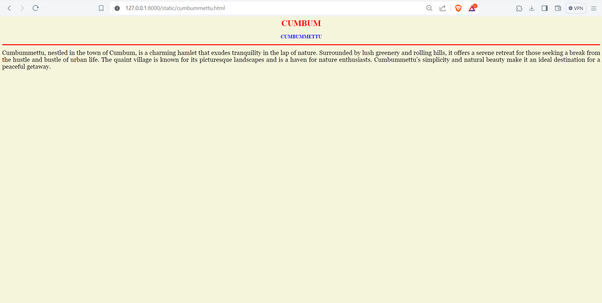

# Ex04 Places Around Me
## Date: 27/03/2024

## AIM
To develop a website to display details about the places around my house.

## DESIGN STEPS

### STEP 1
Create a Django admin interface.

### STEP 2
Download your city map from Google.

### STEP 3
Using ```<map>``` tag name the map.

### STEP 4
Create clickable regions in the image using ```<area>``` tag.

### STEP 5
Write HTML programs for all the regions identified.

### STEP 6
Execute the programs and publish them.

## CODE
### MAP:
```
<html>

<head>

<title>My City</title>

</head>

<body>

<h1 align="center">

<font color="red"><b>CUMBUM</b></font>

</h1>

<h3 align="center">

<font color="blue"><b>SANTHOSH K(212223100050)</b></font>

</h3>

<center>


<map name="MyCity">

    
    <map name="image_map">
      <area alt="CUMBUMMETTU" title="CUMBUMMETTU" href="cumbummettu.html" coords="168,328,203,366" shape="rect">
      <area alt="SURULIPATTI" title="SURULIPATTI" href="surulipatti.html" coords="1217,872,1294,1092" shape="rect">
      <area alt="CUMBUM" title="CUMBUM" href="cumbum.html" coords="1029,492,1063,528" shape="rect">
      <area alt="NATRAJ KALAYANA MANDAPAM" title="NATRAJ KALAYANA MANDAPAM" href="natrajkalyanamandapam.html" coords="889,643,913,679" shape="rect">
      <area alt="JSD MAHAL" title="JSD MAHAL" href="jsdmahal.html" coords="1060,376,1092,409" shape="rect">
    </map>
</map>

</center>

</body>

</html>
```
### HomeTown:
```
<html>

<head>

<title>My Home Town</title>

</head>

<body bgcolor="white">

<h1 align="center">

<font color="red"><b>CUMBUM</b></font>

</h1>

<h3 align="center">

<font color="blue"><b>HOME TOWN</b></font>

</h3>

<hr size="3" color="red">

<p align="justify">

<font face="Georgia" size="5">

    Cumbum, a quaint town nestled in the foothills of the Western Ghats in Tamil Nadu, India, charms visitors with its scenic beauty and cultural richness. Surrounded by lush greenery and fertile valleys, Cumbum is renowned for its agricultural prowess, particularly in grape cultivation. The town's serene ambiance, coupled with the vibrant local markets and warm hospitality, makes it an inviting destination for those seeking a peaceful retreat in the lap of nature.
</p>

</body>

</html>
```

### CUMBUMMETTU:
```
<html>

<head>

<title>My Home Town</title>

</head>

<body bgcolor="beige">

<h1 align="center">

<font color="red"><b>CUMBUM</b></font>

</h1>

<h3 align="center">

<font color="blue"><b>CUMBUMMETTU</b></font>

</h3>

<hr size="3" color="red">

<p align="justify">

<font face="Georgia" size="5">

    Cumbummettu, nestled in the town of Cumbum, is a charming hamlet that exudes tranquility in the lap of nature. Surrounded by lush greenery and rolling hills, it offers a serene retreat for those seeking a break from the hustle and bustle of urban life. The quaint village is known for its picturesque landscapes and is a haven for nature enthusiasts. Cumbummettu's simplicity and natural beauty make it an ideal destination for a peaceful getaway.
</p>

</body>

</html>
```

### JSD MAHAL:
```
<html>

<head>

<title>My Home Town</title>

</head>

<body bgcolor="orange">

<h1 align="center">

<font color="red"><b>CUMBUM</b></font>

</h1>

<h3 align="center">

<font color="cyan"><b>JSD MAHAL</b></font>

</h3>

<hr size="3" color="blue">

<p align="justify">

<font face="Georgia" size="5">

    JSD Mahal in Cumbum is a majestic venue known for its architectural grandeur. Situated amid serene surroundings, it has become a preferred destination for events. While I don't have real-time information on actors staying there, it has hosted various notable personalities.
</p>

</body>

</html>
```

### NATRAJ KALYANA MANDAPAM:
```
<html>

<head>

<title>My Home Town</title>

</head>

<body bgcolor="cyan">

<h1 align="center">

<font color="red"><b>CUMBUM</b></font>

</h1>

<h3 align="center">

<font color="orange"><b>NATRAJ KALAYANA MANDAPAM</b></font>

</h3>

<hr size="3" color="blue">

<p align="justify">

<font face="Georgia" size="5">

    Natraj Kalyana Mandapam in Cumbum is a splendid venue renowned for hosting memorable weddings and events. Its elegant architecture, spacious halls, and modern amenities make it a preferred choice for celebrations. Nestled in the heart of Cumbum, it offers a perfect blend of tradition and convenience for special occasions.
</p>

</body>

</html>
```
### SURULIPATTU:
```<html>

<head>

<title>My Home Town</title>

</head>

<body bgcolor="grey">

<h1 align="center">

<font color="red"><b>CUMBUM</b></font>

</h1>

<h3 align="center">

<font color="blue"><b>SURULIPATTI</b></font>

</h3>

<hr size="3" color="red">

<p align="justify">

<font face="Georgia" size="5">

    Surulipatti, nestled in the scenic town of Cumbum, is a quaint village that exudes rural charm. Surrounded by lush greenery, it offers a serene atmosphere with its traditional homes and agricultural landscapes. The simplicity of Surulipatti provides a refreshing escape, making it a hidden gem in the heart of Cumbum.
</p>

</body>

</html>

```

## OUTPUT:





## RESULT
The program for implementing image maps using HTML is executed successfully.
